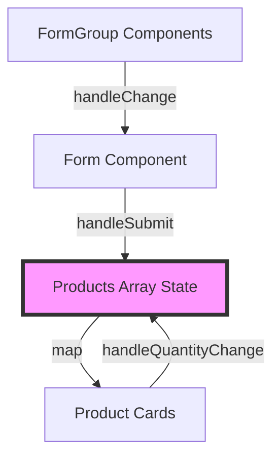
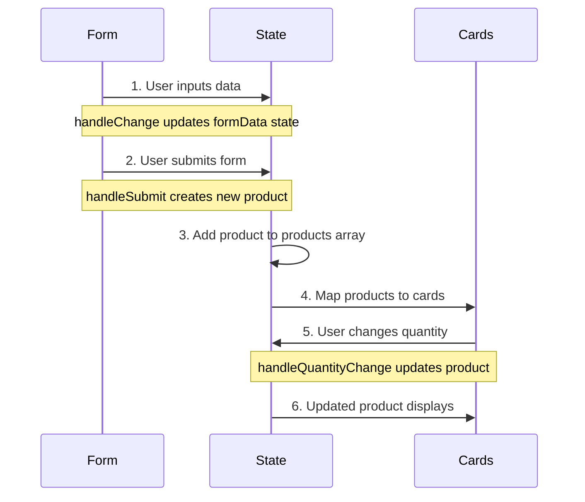
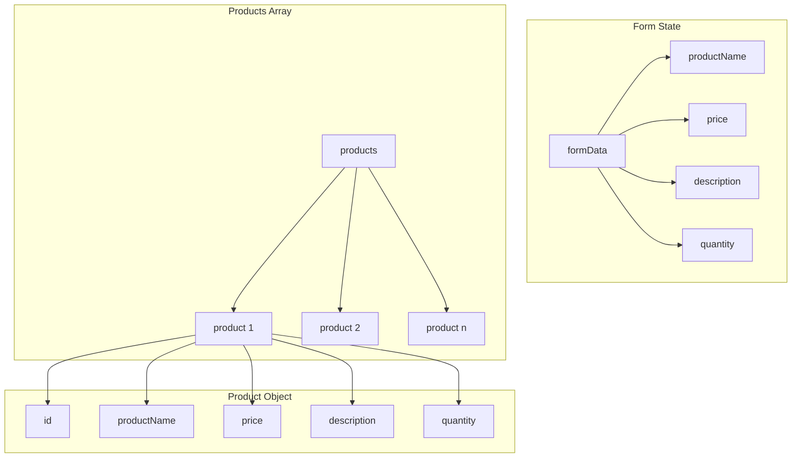
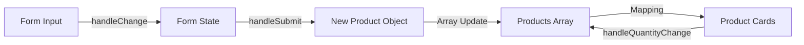

<div dir="rtl">

# تمرين إدارة المنتجات باستخدام React 🛍️

## نظرة عامة

في هذا التمرين، ستقوم بإنشاء واجهة لإدارة المنتجات باستخدام React وTailwind CSS. ستمكّن هذه الواجهة المستخدمين من إضافة المنتجات عبر نموذج عرضها كبطاقات تحتوي على خاصية التحكم في الكمية.

## الأهداف التعليمية

- فهم مكونات React وإدارة الحالة.
- التعامل مع الفورم وإدخال البيانات من المستخدم.
- إنشاء مكونات قابلة لإعادة الاستخدام.
- تنسيق المظهر باستخدام Tailwind CSSء.
- إدارة قوائم البيانات في React.

## المتطلبات

### الأدوات التقنية

</div>

- React.js & Tailwind CSS

<div dir="rtl">

### الميزات التي يجب تنفيذها

1. **نموذج إدخال المنتج**:

   - اسم المنتج (حقل نصي)
   - السعر (حقل رقمي)
   - الوصف (حقل نصي متعدد الأسطر)
   - الكمية المتوفرة (حقل رقمي)
   - زر الإرسال

2. **بطاقات عرض المنتجات**:
   - عرض المنتجات التي تم إضافتها
   - عرض تفاصيل كل منتج
   - التحكم في الكمية (أزرار زيادة/نقصان)

## الكود المبدئي

</div>

```jsx
import Card from "./components/Card";
import FormGroup from "./components/FormGroup";

const Store = () => {
  // TODO: قم بتعريف متغيرين لإدارة الحالة:
  // 1. formData: لإدارة قيم المدخلات في الفورم.
  // 2. products: لتخزين قائمة المنتجات.

  const handleSubmit = (e) => {
    e.preventDefault();
    // TODO: تنفيذ عملية الإرسال:
    // 1. منع إرسال البيانات الفارغة.
    // 2. إنشاء كائن منتج جديد بمعرّف فريد.
    // 3. إضافة المنتج الجديد إلى مصفوفة المنتجات.
    // 4. إعادة تعيين الفورم.
  };

  const handleChange = (e) => {
    // TODO: تنفيذ التعامل مع تغيير المدخلات:
    // 1. الحصول على الاسم والقيمة من العنصر الذي حدث به التغيير.
    // 2. تحديث حالة formData بالقيمة الجديدة.
  };

  const handleQuantityChange = (id, increment) => {
    // TODO: تنفيذ تعديل الكمية:
    // 1. إيجاد المنتج الذي يحتوي على المعرّف المطلوب.
    // 2. تعديل الكمية (مع التأكد من عدم انخفاضها عن 0).
    // 3. تحديث مصفوفة المنتجات بالمنتج المعدّل.
  };

  return (
    <div className="max-w-5xl mx-auto p-6 space-y-8">
      <section className="bg-white rounded-lg shadow-lg p-6">
        {/* TODO: إضافة الفورم باستخدام مكونات FormGroup */}
      </section>

      <div className="grid grid-cols-1 md:grid-cols-3 gap-6">
        {/* TODO: عرض المنتجات من خلال التكرار على مصفوفة المنتجات وإنشاء بطاقات باستخدام مكون Card */}
      </div>
    </div>
  );
};

export default Store;
```

<div dir="rtl">

## المكونات المطلوبة

### مكون FormGroup

أنشئ مكونًا قابلاً لإعادة الاستخدام لإنشاء عناصر إدخال للنماذج:

- مع التنويه القسم المعلم بالاحمر هو مكون react يتم اعادة استخدامه

</div>

```jsx
const FormGroup = () => {
  return (
    // TODO: تنفيذ مكون FormGroup
  );
};
```

## 

<div dir="rtl">

### مكون Card

أنشئ مكونًا لعرض معلومات المنتج في بطاقة:

- مع التنويه القسم المعلم بالاحمر هو مكون react يتم اعادة استخدامه

</div>

```jsx
const Card = () => {
  return (
    // TODO: تنفيذ مكون Card
  );
};
```


<div dir="rtl">

## هيكل تدفق البيانات

### علاقة المكونات

يتبع التطبيق نمط تدفق بيانات أحادي الاتجاه، حيث تُغذى إدخالات النموذج إلى مصفوفة بيانات مركزية، والتي تُستخدم لاحقًا لتحديث بطاقات المنتجات. إليك كيفية تفاعل المكونات:

</div>



<div dir="rtl">

### تسلسل تدفق البيانات

</div>



<div dir="rtl">

### هيكل إدارة الحالة

</div>



<div dir="rtl">

### تدفق تسلسل البيانات

</div>



<div dir="rtl">

### النقاط الرئيسية حول تدفق البيانات:

1. **تدفق التحقق من صحة البيانات**

</div>
   
   ```mermaid
   graph TD
       A[Form Input] -->|Validation| B{Valid?}
       B -->|Yes| C[Add to Products]
       B -->|No| D[Show Error]
   ```

by _Abdulbasit Abdulghani_

[linkedin](www.linkedin.com/in/abdulbasit-abdulgani)
