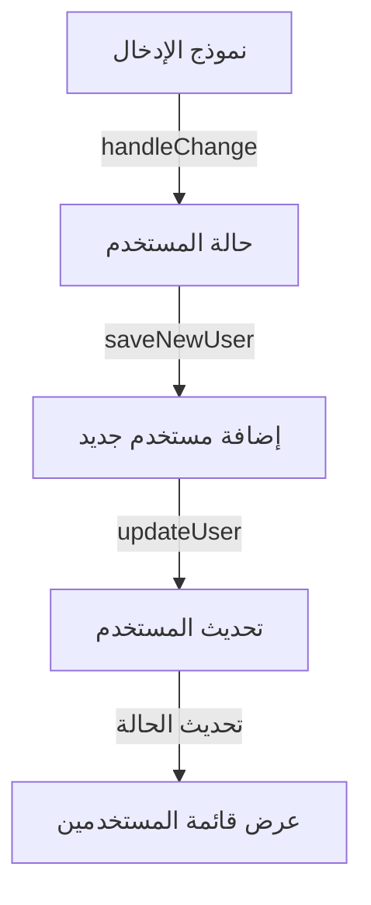
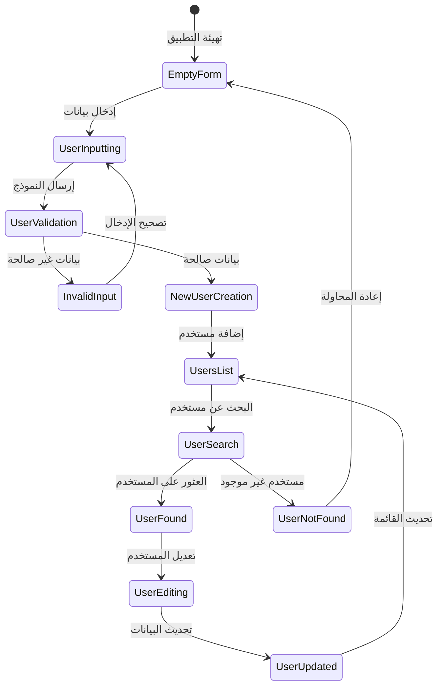
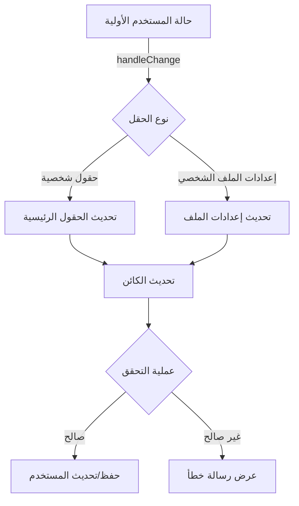
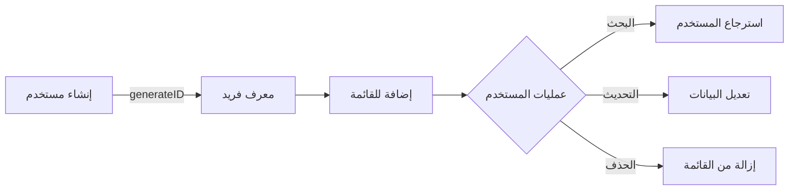
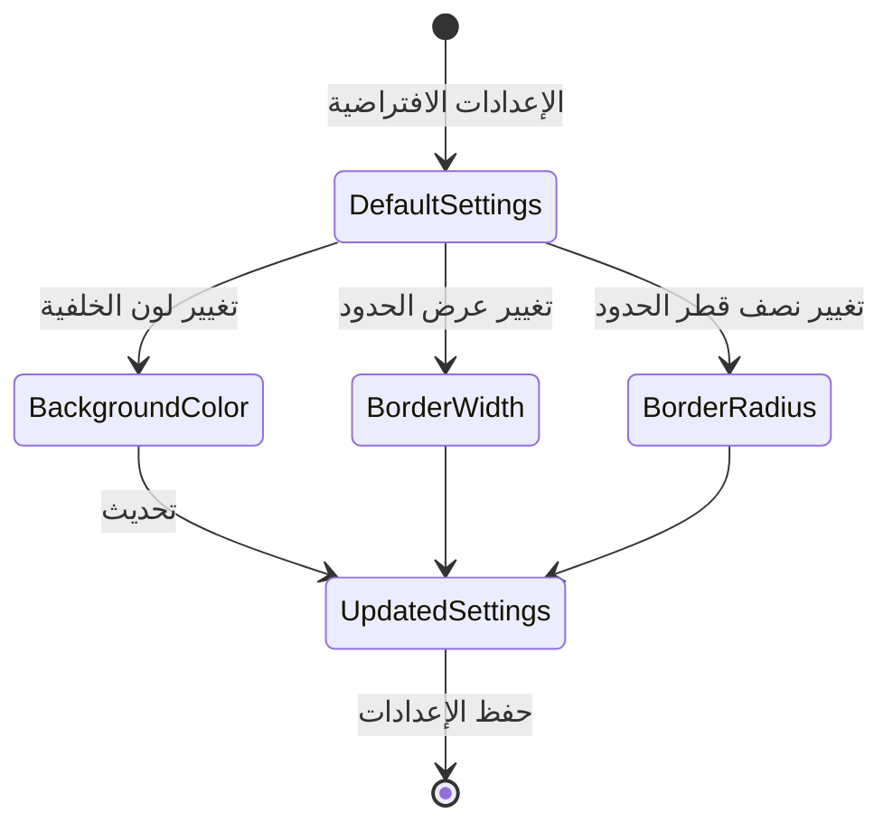

<div dir="rtl">

# دليل إدارة المستخدمين باستخدام React 👥

## نظرة عامة 🌐

في هذا المشروع، سنقوم ببناء تطبيق ويب متكامل لإدارة المستخدمين باستخدام React و Tailwind CSS. سيمكن التطبيق المستخدمين من:

- إضافة مستخدمين جدد
- البحث عن مستخدم بمعرّف محدد
- تحديث بيانات المستخدمين
- عرض قائمة المستخدمين

## الأهداف التعليمية 🎯

1. **إدارة الحالة في React**

   - التعامل مع الحالات المعقدة باستخدام `useState`
   - إدارة كائنات متداخلة
   - تحديث مصفوفة المستخدمين بشكل دينامي

2. **تصميم النماذج التفاعلية**

   - إنشاء نماذج إدخال متعددة الحقول
   - التحقق من صحة البيانات
   - معالجة إدخالات المستخدم

3. **تطبيق التصميم المتجاوب**
   - استخدام Tailwind CSS
   - تنسيق العناصر بشكل مرن
   - دعم مختلف أحجام الشاشات

## المكونات الرئيسية 🧩

### 1. حالة التطبيق الأساسية

</div>

```javascript
const [user, setUser] = useState({
  id: "",
  firstName: "",
  lastName: "",
  birthday: "",
  profileSettings: {
    bgColor: "#ffffff",
    borderWidth: "1px",
    borderRadius: "8px",
  },
});
```

<div dir="rtl">

### 2. الدوال الأساسية

#### دالة معالجة التغييرات

</div>

```javascript
const handleChange = (e) => {
  const { name, value } = e.target;
  // معالجة التحديثات للحقول العادية وإعدادات الملف الشخصي
};
```

<div dir="rtl">

#### دالة إضافة مستخدم جديد

</div>

```javascript
const saveNewUser = (e) => {
  e.preventDefault();
  // التحقق من صحة البيانات
  // إنشاء معرف فريد
  // إضافة المستخدم للقائمة
};
```

<div dir="rtl">

## تدفق البيانات 🔄

### مخطط تدفق البيانات

</div>



<div dir="rtl">

## مخطط حالات إدارة المستخدم

</div>



<div dir="rtl">

## مخطط تدفق تغيير الحالة

</div>



<div dir="rtl">

## مخطط دورة حياة المستخدم

</div>



<div dir="rtl">

## مخطط حالة إعدادات الملف الشخصي

</div>



<div dir="rtl">

## الميزات المتقدمة ✨

- إنشاء معرّفات فريدة باستخدام `Date.now()`
- دعم تخصيص الإعدادات الشخصية
- تحديث وإدارة المستخدمين بكفاءة

## نصائح التحسين 🚀

1. إضافة التحقق المتقدم من صحة البيانات
2. التعامل مع حالات الخطأ بشكل أفضل
3. تطبيق تصميم مستجيب بالكامل

## التحديات المحتملة 🧩

- التعامل مع إدخال بيانات غير صالحة
- تحديث المستخدمين بدقة
- إدارة حالة التطبيق بكفاءة

**المؤلف**: عبد الباسط عبد الغني
**روابط التواصل**:

- [LinkedIn](https://www.linkedin.com/in/abdulbasit-abdulgani)
</div>
