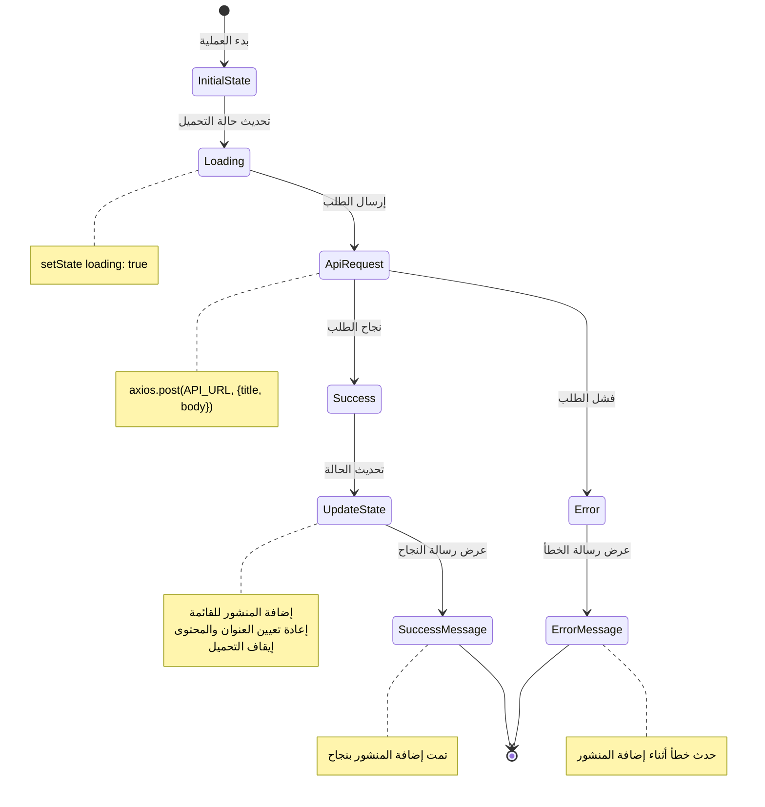
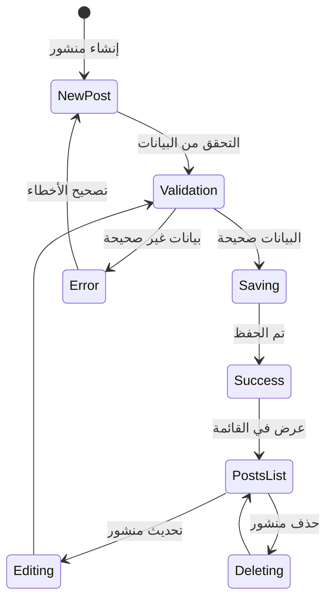

<div dir="rtl">

# دليل إدارة المنشورات باستخدام React 📝

## نظرة عامة 🌐

في هذا المشروع، قمنا ببناء تطبيق ويب متكامل لإدارة المنشورات باستخدام React و Axios و Tailwind CSS. يمكّن التطبيق المستخدمين من:

- إنشاء منشورات جديدة
- عرض قائمة المنشورات
- تحديث المنشورات الموجودة
- حذف المنشورات

## الأهداف التقنية 🎯

1. **إدارة الحالة المركزية**
   - استخدام `useState` لإدارة جميع بيانات التطبيق
   - التعامل مع الحالات المتعددة في كائن واحد
   - إدارة حالات التحميل والتنبيهات

2. **التفاعل مع API**
   - استخدام Axios للتعامل مع الطلبات
   - معالجة الاستجابات والأخطاء
   - تنفيذ عمليات CRUD كاملة

3. **تصميم واجهة المستخدم**
   - تطبيق تصميم متجاوب باستخدام Tailwind CSS
   - تنفيذ تنبيهات تفاعلية
   - تحسين تجربة المستخدم مع حالات التحميل

## المكونات الرئيسية 🧩

### 1. حالة التطبيق الأساسية

</div>


```javascript
const [state, setState] = useState({
  posts: [],
  title: "",
  body: "",
  editId: null,
  loading: false,
  alert: { show: false, type: '', message: '' }
});
```
<div dir="rtl">

### 2. الدوال الأساسية

#### معالجة إضافة منشور جديد

</div>

```javascript
const addPost = async () => {   
};
```


<div dir="rtl">

## تدفق البيانات 🔄

### مخطط دورة حياة المنشور

</div>



<div dir="rtl">

## ميزات متقدمة ✨

1. **إدارة الحالة الموحدة**
   - جميع حالات التطبيق في كائن واحد
   - تحديث فعال للحالة
   - منع تكرار الكود

2. **معالجة الأخطاء**
   - عرض رسائل خطأ واضحة
   - استعادة الحالة عند فشل العمليات
   - تنبيهات تفاعلية

3. **تحسينات تجربة المستخدم**
   - مؤشرات تحميل متحركة
   - تأثيرات انتقالية سلسة
   - تصميم متجاوب

## نصائح للتحسين 🚀

1. إضافة تأكيد قبل الحذف
2. تنفيذ نظام تصنيف للمنشورات
3. إضافة ميزة البحث
4. تنفيذ نظام مصادقة
5. إضافة خيارات تصفية وترتيب

## التحديات المحتملة 🧩

1. **معالجة الأخطاء**
   - فقدان الاتصال بالخادم
   - بطء الاستجابة
   - فشل العمليات

2. **أداء التطبيق**
   - تحسين عمليات تحديث الحالة
   - تقليل عمليات إعادة التصيير
   - إدارة الذاكرة

3. **تجربة المستخدم**
   - تحسين زمن الاستجابة
   - توفير تغذية راجعة فورية
   - التعامل مع حالات الخطأ بشكل ودي

**المؤلف**: عبد الباسط عبد الغني
**روابط التواصل**:

- [LinkedIn](https://www.linkedin.com/in/abdulbasit-abdulgani)

</div>